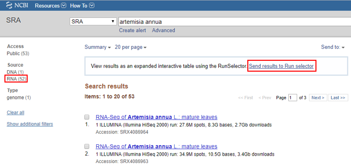

# Getting started
Welcome to the tutorial on how to use the LSTrAP-Lite source code!
We will use the sample data provided to demonstrate where the code should be modified to build your own co-expression networks.

## Software requirements
  * [aspera cli (optional)](https://downloads.asperasoft.com/en/downloads/62)
  * [python 3](https://www.python.org/downloads/)
  * [kallisto v0.44.0](https://pachterlab.github.io/kallisto/download)
  

## Selecting the files to download
  * Go to [NCBI SRA](https://www.ncbi.nlm.nih.gov/sra)
  * Search for the files that you want to download, select only RNA sources and send results to RunSelector.   
    Eg. <i>Artemisia annua</i> 
    
  * Download the RunInfo Table
    
  * Copy the "Run" and "LibraryLayout" columns for the samples you want to download from the SraRunTable and paste it into a new file. Refer to the example [here](/sample_data/sra_runID.txt).

## Download the CDS file for the organism of interest
  * For the tutorial, we will be downloading the CDS file of <i>Artemisia annua</i> from NCBI RefSeq. Download at ftp://ftp.ncbi.nlm.nih.gov/genomes/all/GCA/003/112/345/GCA_003112345.1_ASM311234v1/GCA_003112345.1_ASM311234v1_cds_from_genomic.fna.gz.
  * For CDS files from other sources, please refer to the [kallisto manual](https://pachterlab.github.io/kallisto/manual) for compatibility of your fasta file to build the <b>kallisto index</b> file.

## Modifying the paths

In the section "Paths to edit" found in [LSTrAP-Lite_download.py](../LSTrAP-Lite_download.py), there are a few paths that needs to be modified for the script to work. <i>Note: In order for aspera to run on the Rock64, an emulator is required to emulate the x86 architecture. This was previously acheivable via the emulator provided by Exagear Desktop, which has been discontinued.</i>
  * <b>pathtolocal</b> refers to the directory that your will be working in to download and process the files.
  * <b>download_list</b> refers to the file that contains the SRA run ID and the respective library format of the files that you want to download.
  * <b>kallisto_fasta</b> refers to the CDS file that will be used to generate the kallisto index file
  * <b>pathtoaspera</b> refers to the location to where the aspera cli executable is located
  * <b>aspera_ssh_key</b> refers to the location to where the aspera ssh key is found
  * <b>pathtokallisto</b> refers to the location where the kallisto executable is located
  
For this tutorial, we will be working in the directory "sample_data".

## Running the script
Save the script in the directory specified in "pathtolocal". Enter the directory speicified in "pathtolocal" and run the script.

<code>python3 LSTrAP-Lite_download.py</code>

Quality control and selection of SRA runs to be used for subsequent analysis will be covered in the [next section](02_qc.md).
