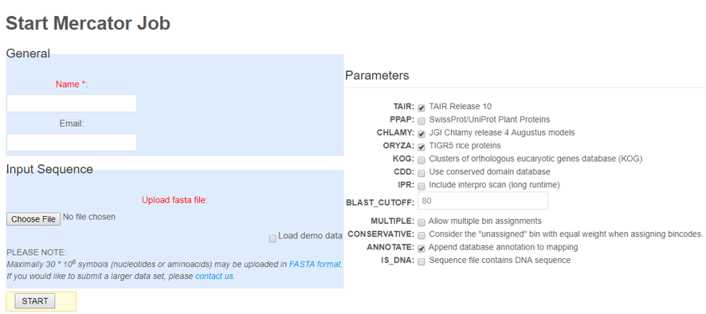

# Advanced tutorial
Combining mercator results with the neighbourhood file.

## Generating annotation using Mercator
  * Go to the [Mercator](https://mapman.gabipd.org/app/mercator) webpage
  * Create a new job
  * Fill out the form and upload the protein (preferrable) FASTA file. The following options suggested (TAIR, CHLAMY, ORYZA and ANNOTATE) are not exhaustive.
  
  
## Combining the neighbourhood file(s) with Mercator results
This section will be a little tricky as it has to be customised for your data and may require some basic knowledge in Python. Nonetheless, I will give an example using the <i>Artemisia annua</i> results. The script is available [here](../LSTrAP-Lite_NbhAnno.py).

  * Update the variable <b>mer_file</b> to specify the location of the mercator result file
  * In line 7 of the code <code>if "pwa" in i.split("\t")[2]:</code>, replace "pwa" with an identifier common for all the genes. In this case, all <i>A. annua</i> proteins started with "pwa". E.g. pwa68789.1
  * Next, there are 2 options available, 1) to modify one neighbourhood file or 2) to modify all the neighbourhood files found in a directory. Choose one option and comment out or delete the unecessary option. Refer to the respective sections to continue.
    * Modify one neighbourhood file
      * Update the variable <b>file_in</b> with the location of the neighbourhood file you want to modify.
    * Modify all neighbourhood files in a directory
      * Update the variable <b>curdir</b> with the path of the directory where the neighbourhood files are saved
  * Modify the variable <b>gene2</b> accordingly. This was necessary in the case of <i>A. annua</i> as the gene identifier in the CDS file and protein file was different. E.g. CDS identifier: lcl|PKPP01004763.1_cds_PWA62882.1_36881; protein identifier: PWA62882.1   In order for the script to work, the gene identifier here has to match with the gene identifier present in the mercator results file.   Below are possible scenarios and the corresponding solutions provided (non-exhaustive):
    * CDS and protein (mercartor) gene identifiers are identical | <code>gene2 = x.split("\t")[0]</code>
    * Protein gene identifier is embedded in CDS gene identifier as in the case of <i>A. annua</i> Eg. <code>gene2 = x.split("\t")[0]</code> -> lcl|PKPP01004763.1_cds_PWA62882.1_36881 <code>gene2 = x.split("\t")[0].split("cds_")[1]</code> -> PWA62882.1_36881 <code>gene2 = x.split("\t")[0].split("cds_")[1].split("_")[0]</code> -> PWA62882.1 <i>OR</i> <code>gene2 = x.split("\t")[0].split("\_")[2]</code> -> PWA62882.1  In essence, the <b>split()</b> function allows you to split a string at the location(s) desired. The <b>\[ ]</b> after the split function is used to specify the position of the desired part of the splitted string. Tip: Python starts counting from '0'.
